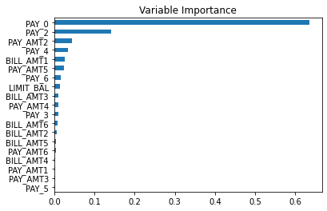
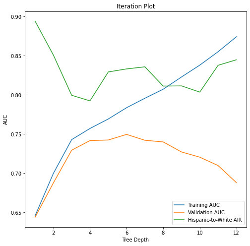

# DNSC_6301_Project_Group3
DNSC 6301 Bootcamp Project by Group 3

## Credit Line Increase Model Card

### Basic Information

* **Person or organization developing model**: Jenny Yazlovsky, `jyazlovsky@gwu.edu`
* **Model date**: August 26, 2022
* **Model version**: 1.0
* **License**: MIT
* **Model implementation code**: [Bootcamp Project - Group 3 Yazlovsky.ipynb](Bootcamp_Project_Group_3_Yazlovsky.ipynb)

### Intended Use
* **Primary intended uses**: This model is an *example* probability of default classifier, with an *example* use case for determining eligibility for a credit line increase.
* **Primary intended users**: Students in GWU DNSC 6301 bootcamp.
* **Out-of-scope use cases**: Any use beyond an educational example is out-of-scope.

### Training Data

* Data dictionary: 

| Name | Modeling Role | Measurement Level| Description|
| ---- | ------------- | ---------------- | ---------- |
|**ID**| ID | int | unique row indentifier |
| **LIMIT_BAL** | input | float | amount of previously awarded credit |
| **SEX** | demographic information | int | 1 = male; 2 = female
| **RACE** | demographic information | int | 1 = hispanic; 2 = black; 3 = white; 4 = asian |
| **EDUCATION** | demographic information | int | 1 = graduate school; 2 = university; 3 = high school; 4 = others |
| **MARRIAGE** | demographic information | int | 1 = married; 2 = single; 3 = others |
| **AGE** | demographic information | int | age in years |
| **PAY_0, PAY_2 - PAY_6** | inputs | int | history of past payment; PAY_0 = the repayment status in September, 2005; PAY_2 = the repayment status in August, 2005; ...; PAY_6 = the repayment status in April, 2005. The measurement scale for the repayment status is: -1 = pay duly; 1 = payment delay for one month; 2 = payment delay for two months; ...; 8 = payment delay for eight months; 9 = payment delay for nine months and above |
| **BILL_AMT1 - BILL_AMT6** | inputs | float | amount of bill statement; BILL_AMNT1 = amount of bill statement in September, 2005; BILL_AMT2 = amount of bill statement in August, 2005; ...; BILL_AMT6 = amount of bill statement in April, 2005 |
| **PAY_AMT1 - PAY_AMT6** | inputs | float | amount of previous payment; PAY_AMT1 = amount paid in September, 2005; PAY_AMT2 = amount paid in August, 2005; ...; PAY_AMT6 = amount paid in April, 2005 |
| **DELINQ_NEXT**| target | int | whether a customer's next payment is delinquent (late), 1 = late; 0 = on-time |

* **Source of training data**: GWU Blackboard, email `jphall@gwu.edu` for more information
* **How training data was divided into training and validation data**: 50% training, 25% validation, 25% test
* **Number of rows in training and validation data**:
  * Training rows: 15,000
  * Validation rows: 7,500

### Test Data
* **Source of test data**: GWU Blackboard, email `jphall@gwu.edu` for more information
* **Number of rows in test data**: 7,500
* **State any differences in columns between training and test data**: None

### Model details
* **Columns used as inputs in the final model**: 'LIMIT_BAL',
       'PAY_0', 'PAY_2', 'PAY_3', 'PAY_4', 'PAY_5', 'PAY_6', 'BILL_AMT1',
       'BILL_AMT2', 'BILL_AMT3', 'BILL_AMT4', 'BILL_AMT5', 'BILL_AMT6',
       'PAY_AMT1', 'PAY_AMT2', 'PAY_AMT3', 'PAY_AMT4', 'PAY_AMT5', 'PAY_AMT6'
* **Column(s) used as target(s) in the final model**: 'DELINQ_NEXT'
* **Type of model**: Decision Tree 
* **Software used to implement the model**: Python, scikit-learn
* **Version of the modeling software**:
  * Python version: 3.7.13
  * sklearn version: 1.0.2
* **Hyperparameters or other settings of model**: 
```
 {'ccp_alpha': 0.0,
 'class_weight': None,
 'criterion': 'gini',
 'max_depth': 6,
 'max_features': None,
 'max_leaf_nodes': None,
 'min_impurity_decrease': 0.0,
 'min_samples_leaf': 1,
 'min_samples_split': 2,
 'min_weight_fraction_leaf': 0.0,
 'random_state': 12345,
 'splitter': 'best'}
 ```
 
### Quantitative Analysis
* **Metrics used to evaluate final model**: AUC and AIR

| Training AUC |  Validation AUC | Test AUC | hispanic-to-white AIR | black-to-white AIR | asian-to-white AIR | female-to-male AIR|
| ------------ | --------------- | -------- | ------------ | -------------- | -------- | -------- |
| 0.783722 | 0.749610 | 0.7438 | 0.83 | 0.85 | 1.00 | 1.02 |


#### Correlation Heatmap


From the heatmap, we can see that:
* History of past payments (PAY_0, PAY_2 - PAY_6) has a negative correlation with the amount of previously awarded credit (LIMIT_BAL). This means the longer the customer was delayed in making their payment, the less credit they were awarded previously.
* RACE and DELINQ_NEXT (whether or not someone missed their next payment) have a negative correlation; meaning, in this data set Hispanic and black customers were found to miss their next payment more than white or Asian customers.
* EDUCATION has a negative correlation with LIMIT_BAL (amount of previously awarded credit). This means the more educated consumers were, the more credit they were awarded.
* DELINQ_NEXT (whether or not someone missed their next payment) and LIMIT_BAL (amount of previously awarded credit) have a negative correlation, which means customers that did not miss their next payment were awarded more credit than customers that did miss their next payment.
* A negative correlation was found between AGE and MARRIAGE (more older customers were found to be married than younger customers).


#### Decision Tree Plot


A decision tree with a depth of 6 is pictured above. The gini splitting criterion was used to determine which feature was split and how it was split. 

#### Variable Importance

PAY_AMT5 (amount paid in May, 2005) was the most used variable in the decision tree plot which could result in thinking that is has a higher importance

#### Final Iteration Plot


The final iteration plot pictured above includes performance and fairness indicators. It shows that at Dep = 6 is where we see the best fairness and the best performance.

### Ethical Considerations
* **Potential negative impacts of using this model**: This model has the potential chance to have encoded different types of biases (i.e. historical, societal, and/or institutional bias). Bias originates from training data as sociological biases could have been present in data collection, labeling, or storage processes. In an effort to avoid creating a biased model, the output of the model was built to be independent of the demographics of the user.
* **Potential uncertainties of this model**: The statistical significance of the input variables was not calculated. Statistical significance allows us to determine if the relationship between variables was caused by something other than chance.
* **Unexpected Results**: Although demographic inputs were removed, unintentional discrimination (disparate impact) was still found against Hispanic and Black customers in the model.
